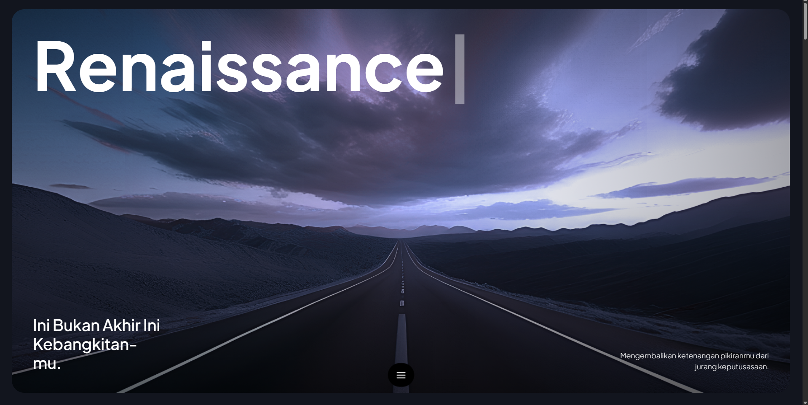
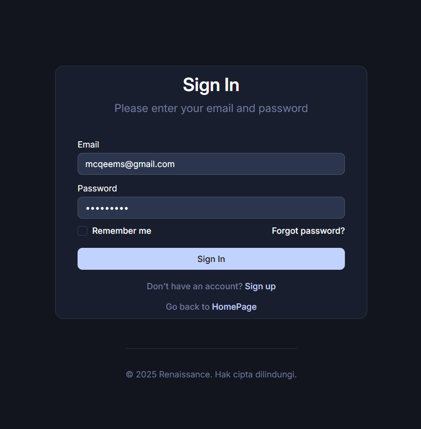
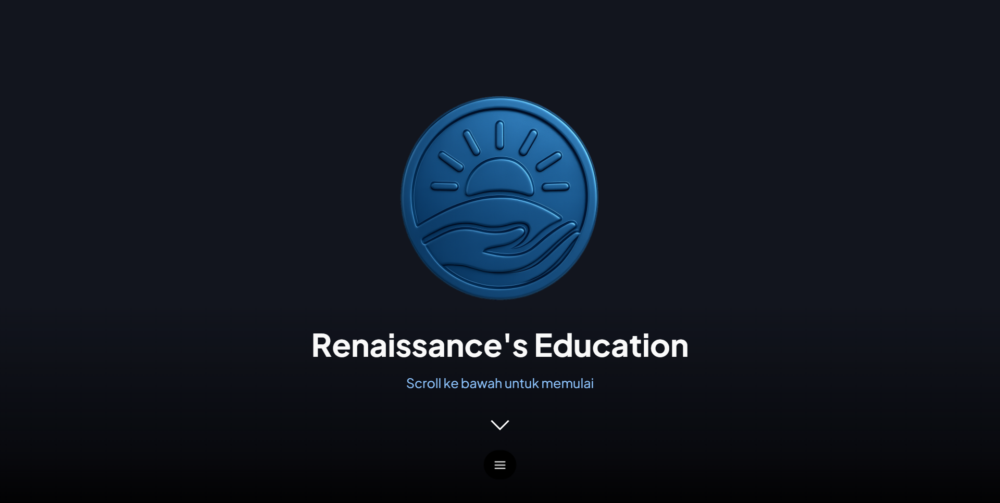
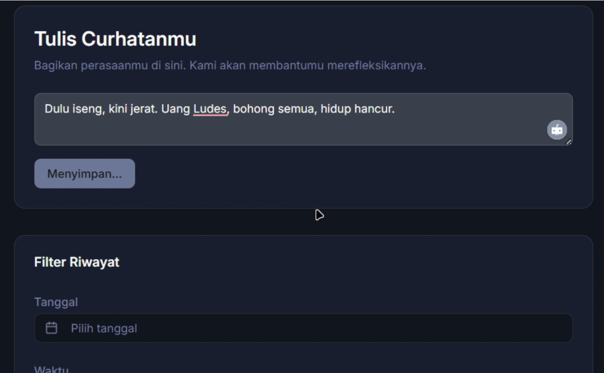
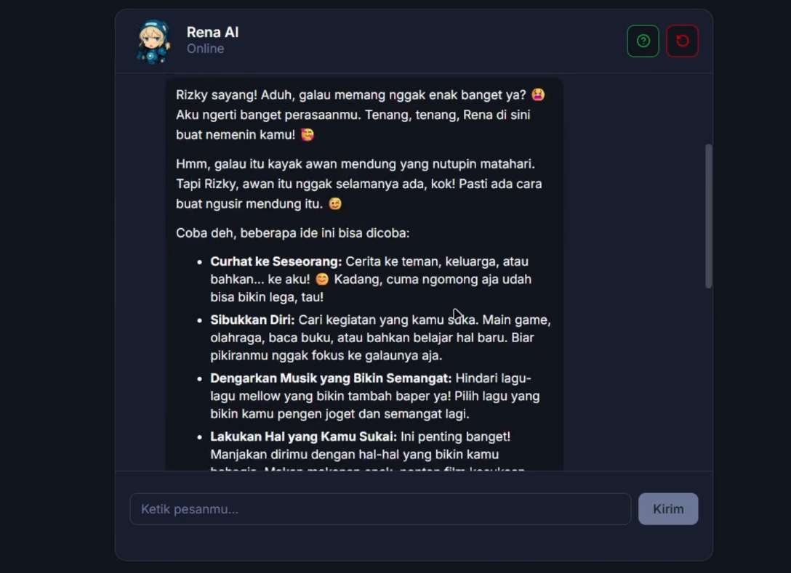
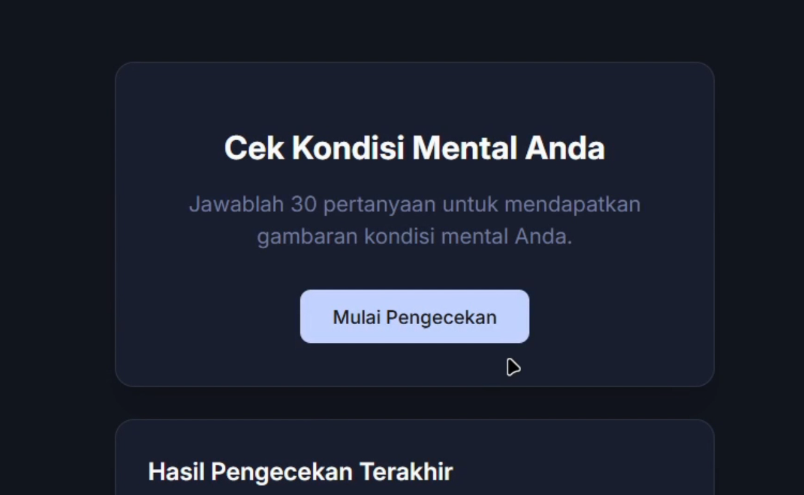
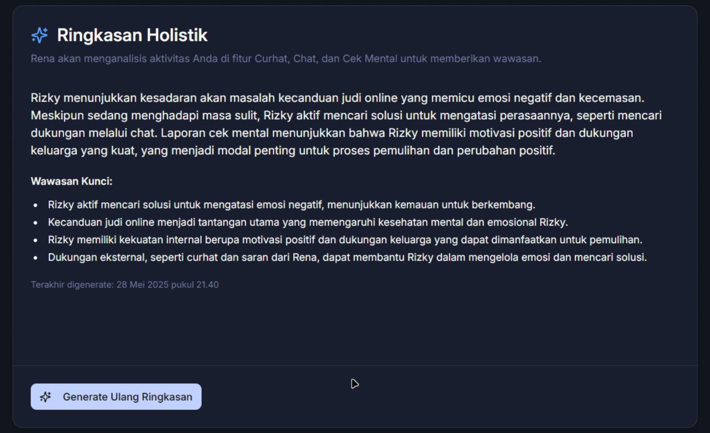
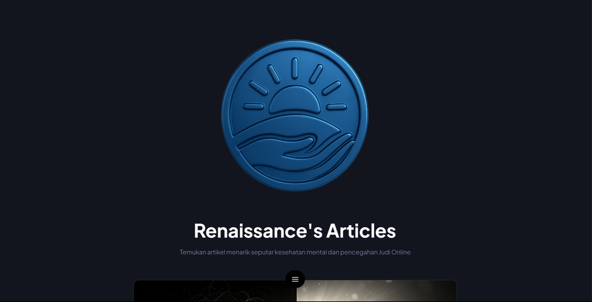

# 

# ✨ Renaissance

**AI-Powered Web App untuk Edukasi & Self-Support dalam Pencegahan Dampak Judi Online**

Renaissance adalah aplikasi web berbasis AI yang dirancang untuk edukasi dini dan dukungan mandiri bagi individu yang berisiko mengalami kecanduan judi online. Dengan pendekatan preventif dan teknologi modern seperti analisis sentimen dan chatbot AI, Renaissance membantu membangun ketahanan mental masyarakat di era digital.

---

## 🚨 Masalah yang Diselesaikan

Kecanduan judi online merupakan ancaman nyata bagi kesehatan mental masyarakat, terutama generasi muda. Kurangnya edukasi, stigma mencari bantuan, dan minimnya platform reflektif menjadi pemicu tingginya risiko kecanduan.

---

## 💡 Solusi Kami

Renaissance menyediakan platform edukatif dan reflektif yang:

- Mengedukasi pengguna secara visual dan ringkas.
- Memberikan ruang curhat dengan analisis sentimen otomatis.
- Memfasilitasi percakapan dengan chatbot AI yang empatik.
- Memberikan asesmen psikologis dan rekomendasi personal.

---

## ✨ Fitur Utama

### 📘 1. Landing Page Informatif

<p align="center">
  
</p>

Halaman utama yang menjelaskan misi Renaissance, isu yang ditangani, dan fitur-fitur unggulan.

---

### 🔐 2. Autentikasi Pengguna

<p align="center">
  
</p>

Pendaftaran & login dengan Firebase Authentication untuk pengalaman personal dan penyimpanan data aman.

---

### 📚 3. Modul Edukasi Preventif

<p align="center">
  
</p>

Modul berbasis komik yang mengajarkan:

- Dampak psikologis judi online
- Tanda-tanda kecanduan
- Tips dasar pengelolaan diri

**✅ Tanpa login untuk jangkauan luas.**

---

### ✍️ 4. Jurnal Refleksi + Analisis Sentimen AI

<p align="center">
  
</p>

Pengguna dapat menulis catatan harian. Sistem akan:

- Menganalisis sentimen menggunakan Azure Cognitive Services
- Memberi insight reflektif
- Menyimpan data untuk pelacakan progres

---

### 🤖 5. Chatbot AI Rena

<p align="center">
  
</p>

Didukung **Azure Bot Service + Gemini**, chatbot ini:

- Menjawab pertanyaan seputar mental health & judi online
- Memberi motivasi dan strategi coping
- Mengarahkan ke sumber bantuan profesional jika diperlukan

---

### 🧪 6. Cek Kondisi Mental (30 Pertanyaan)

<p align="center">
  
</p>

Pengguna menjawab 30 pertanyaan untuk asesmen mental. AI akan:

- Menganalisis jawaban
- Memberikan **deskripsi, diagnosis awal, dan rekomendasi**
- Bertindak seolah psikolog profesional

---

### 📊 7. Smart Dashboard

<p align="center">
  
</p>

Menampilkan:

- Progres edukasi
- Grafik sentimen jurnal
- Hasil cek mental
- Insight AI dan rekomendasi berkelanjutan

---

### 📰 8. Artikel Edukatif

<p align="center">
  
</p>

Kumpulan artikel seputar:

- Kesehatan mental
- Self-development
- Dampak judi online

---

## ⚙️ Tech Stack

| Layer           | Tools/Services                                                                                                                                                                                                                                                                |
| --------------- | ----------------------------------------------------------------------------------------------------------------------------------------------------------------------------------------------------------------------------------------------------------------------------- |
| **Frontend**    |                                           |
| **Backend**     |                                                                                                                                                      |
| **Auth**        |                                                                                                                                                             |
| **Database**    |                                                                                                                                                     |
| **AI Services** |   |
| **Chatbot**     |                               |

---

## 🎯 Visi

Renaissance mendukung SDG **(Sustainable Development Goals)** terutama:

- SDG 3: Kesehatan dan Kesejahteraan

---

## 🤝 Cara Berkontribusi

Kami sangat menyambut kontribusi dari siapa pun yang ingin membantu mengembangkan Renaissance lebih lanjut!

### 📦 Langkah Instalasi & Setup Project

1. **Pastikan Anda sudah menginstal:**

   - Node.js (versi LTS)
   - npm
   - Git

2. **Clone repositori ini:**

```bash
git clone https://github.com/mcqeems/renaissance
cd renaissance
```

Untuk menyiapkan **frontend** aplikasi Anda yang dibangun dengan **React.js**, ikuti langkah-langkah berikut:

1.  **Masuk ke direktori _frontend_**:

    ```bash
    cd frontend
    ```

2.  **Instal _dependencies_**:

    ```bash
    npm install --legacy-peer-deps
    ```

    **Penting**: Gunakan `--legacy-peer-deps` karena beberapa _dependency_ adalah versi _legacy_ yang bisa gagal jika hanya menggunakan `npm install` biasa.

3.  **Buat file `.env`** di dalam direktori _frontend_ dan isi dengan variabel lingkungan berikut. Pastikan Anda mengisi nilai yang sesuai untuk setiap variabel.

    ```env
    VITE_FIREBASE_API_KEY=
    VITE_FIREBASE_AUTH_DOMAIN=
    VITE_FIREBASE_PROJECT_ID=
    VITE_FIREBASE_STORAGE_BUCKET=
    VITE_FIREBASE_MESSAGING_SENDER_ID=
    VITE_FIREBASE_APP_ID=
    VITE_FIREBASE_MEASUREMENT_ID=
    VITE_BOT_DIRECT_LINE_SECRET=
    VITE_API_BASE_URL=
    ```

4.  **Jalankan aplikasi _frontend_**:

    ```bash
    npm run dev
    ```

    Aplikasi akan otomatis berjalan di `http://localhost:5173`.

---

Untuk menyiapkan **backend** aplikasi Anda yang dibangun dengan **Express.js**, ikuti langkah-langkah berikut:

1.  **Masuk ke direktori _backend_**:

    ```bash
    cd ../backend
    ```

2.  **Instal _dependencies_**:

    ```bash
    npm install
    ```

3.  **Buat file `.env`** di dalam direktori _backend_ dan isi dengan variabel lingkungan berikut. Pastikan Anda mengisi nilai yang sesuai untuk setiap variabel.

    ```env
    AZURE_TEXT_ANALYTICS_KEY=
    AZURE_TEXT_ANALYTICS_ENDPOINT=

    GOOGLE_APPLICATION_CREDENTIALS=

    AZURE_OPENAI_KEY=
    AZURE_OPENAI_ENDPOINT=
    AZURE_OPENAI_DEPLOYMENT_NAME=

    MicrosoftAppId=
    MicrosoftAppPassword=
    BOT_PORT=

    GEMINI_API_KEY=

    GMAIL_USER=
    GMAIL_APP_PASSWORD=

    PORT=
    ```

4.  **Jalankan _backend_** sesuai instruksi di **README _backend_** (jika ada) atau gunakan `pm2` jika Anda ingin menjalankan aplikasi di _background_.

## ⚠️ Catatan

> Renaissance masih dalam tahap MVP. Beberapa fitur akan dikembangkan lebih lanjut.

---

## 📣 Lisensi

MIT License. Bebas digunakan dan dikembangkan untuk tujuan sosial dan edukatif.
